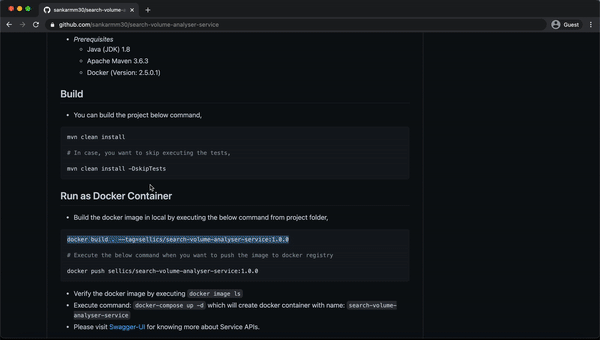

## Search Volume Analyser Service

 - This project has solution for estimating score for the given keyword in [amazon.com](https://www.amazon.com).
 - The score will be in the range [0 → 100] and represent the estimated search-volume (how often Amazon customers search for that exact keyword). 
 - A score of 0 means that the keyword is practically never searched for, 100 means that this is one of the hottest keywords in all of amazon.com right now.
 - This sevice provides below GET endpoint for estimating the score, 
 
````
EXAMPLE API REQUEST

GET http://localhost:8080/amazon/estimate?keyword=iphone

RESPONSE
{
    "keyword": "iphone",
    "score": 96
}
````

#### Project Demo



### Solution

- The main goal is to estimate the score based data we get from Amazon via [auto-complete](https://completion.amazon.com/search/complete) api which returns up to 10 keywords for each request.
- So we try to call auto-complete api as many times to get possible options, and analyse and calculate the score.

#### Assumptions

- Keywords suggested in amazon.com and auto-complete api are not always same. amazon.com suggests keywords based on user and search-volume, and auto-complete api suggests keyword based on search volume.  
- The order of keywords will remain always same in Auto-Complete when we make multiple searches with same keyword. The order will change only when change happens in search-volume in amazon.
- Auto-complete api will never return keyword with special characters but it still accepts keyword with special characters and returns proper result.
- Auto-complete api can return keywords which doesn't match with input search keyword. Example: search-keyword: "zeehana", api result be like ["zehana clothing","zehana pencil skirt","zehanat khan"] 

#### How is score calculated ?

- The main intention is to fetch as much unique keyword by applying different strategies in order to predict the score.
- The final score is calculated based on the outcome received from below strategies,

Strategy | Weightage | Unique Keyword Expected | Number of auto-complete call (max) | Description | Example
--- | --- | --- | --- |--- |---
Search using first letter | 10 | 10 | 1 | Fetch keywords by using FIRST character of given keyword <br> then count the unique keywords which contains input keyword, <br>that will be the score. | keyword: iphone <br> search result using "i": [iphone x, ipad, iphone 12] <br> score: 2 
Search by alphabets & numeric in SUFFIX | 80 | 350 | 36 | Fetch keywords by appending alphabets and numeric in suffix of input keyword <br> then count the unique keywords which contains input keyword, <br>then apply formula to calculate score <br>Formula: score = (no.of unique received * weightage) / (no.of keyword expected) | keyword: iphone <br> assume we received 350 unique keywords <br> score: 80
Search by alphabets & numeric in PREFIX | 10 | 35 | 35 | Fetch keywords by appending alphabets and numeric in prefix of input keyword <br> then count the unique keywords which contains input keyword, <br>then apply formula to calculate score <br>Formula: score = (no.of unique received * weightage) / (no.of keyword expected) | keyword: iphone <br> assume we received 1 unique keywords <br> score: 1 

#### How precise the outcome is and why ?

- The more number of suggestions makes the keyword popular and hottest, so ideally finding out all possible suggestions for the keyword will help in predict the accurate score.
- As the intention of strategy is to find out possible suggestions for the given keyword,this will estimate score closer to what is there in amazon.

### Setup Local Environment

- *Prerequisites*
    - Java (JDK) 1.8
    - Apache Maven 3.6.3
    - Docker (Version: 2.5.0.1)
    
## Build

- You can build the project below command,

```bash
mvn clean install

# In case, you want to skip executing the tests,

mvn clean install -DskipTests
```

## Run as Docker Container

- Build the docker image in local by executing the below command from project folder,

```bash
docker build . --tag=sellics/search-volume-analyser-service:1.0.0

# Execute the below command when you want to push the image to docker registry

docker push sellics/search-volume-analyser-service:1.0.0
```

- Verify the docker image by executing `docker image ls`
- Execute command: `docker-compose up -d` which will create docker container with name: `search-volume-analyser-service`
- Please visit [Swagger-UI](http://localhost:8080/swagger-ui/index.html) for knowing more about Service APIs. 

## Run in Local (In command line)

- Execute the below command after building the project successfully

```bash
java -jar -Dlogging.config=classpath:logback-local.xml -Dspring.profiles.active=local -Djava.util.concurrent.ForkJoinPool.common.parallelism=5 target/search-volume-analyser-service-1.0.0.jar
```
- Please visit [Swagger-UI](http://localhost:8080/swagger-ui/index.html) for knowing more about Employee Service APIs.